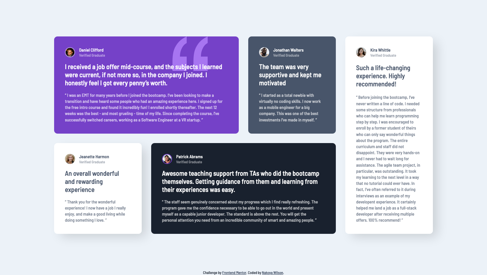

# Frontend Mentor - Testimonials grid section solution

This is a solution to the [Testimonials grid section challenge on Frontend Mentor](https://www.frontendmentor.io/challenges/testimonials-grid-section-Nnw6J7Un7). Frontend Mentor challenges help you improve your coding skills by building realistic projects.

## Table of contents

- [Overview](#overview)
  - [The challenge](#the-challenge)
  - [Screenshot](#screenshot)
  - [Links](#links)
- [My process](#my-process)
  - [Built with](#built-with)
  - [Useful resources](#useful-resources)
- [Author](#author)

**Note: Delete this note and update the table of contents based on what sections you keep.**

## Overview

### The challenge

Users should be able to:

- View the optimal layout for the site depending on their device's screen size

### Screenshot

### Links

- Solution URL: [https://www.frontendmentor.io/solutions/testimonials-grid-section-using-flexbox-and-css-grid-2l7eAU7Xve](https://www.frontendmentor.io/solutions/testimonials-grid-section-using-flexbox-and-css-grid-2l7eAU7Xv)
- Live Site URL: [https://nakoyawilson.github.io/testimonials-grid-section/](https://nakoyawilson.github.io/testimonials-grid-section/)

## My process

### Built with

- HTML
- CSS
- Flexbox
- CSS Grid

### Useful resources

- [CSS Grid - Learn CSS Grid with Wes Bos](https://cssgrid.io/)
- [Grid Garden - A game for learning CSS grid](hhttps://cssgridgarden.com/)

## Author

- Website - [Nakoya Wilson](https://nakoyawilson.netlify.app/)
- Frontend Mentor - [@nakoyawilson](https://www.frontendmentor.io/profile/nakoyawilson)
- Twitter - [@nakoyawilson](https://twitter.com/nakoyawilson)
- LinkedIn - [@nakoyawilson](https://www.linkedin.com/in/nakoyawilson/)
